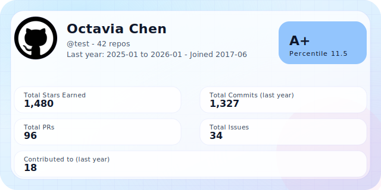
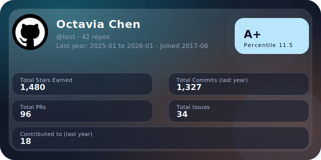
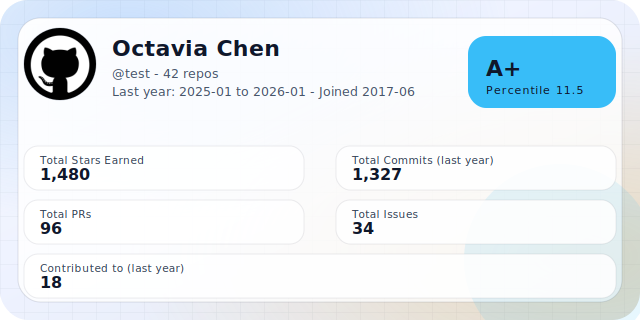
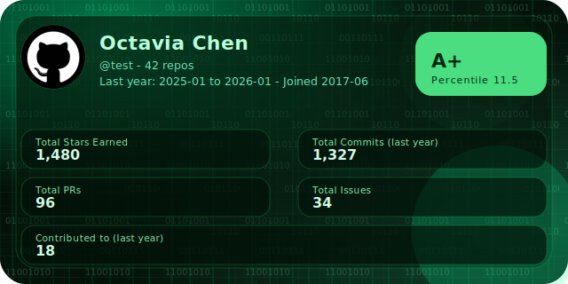
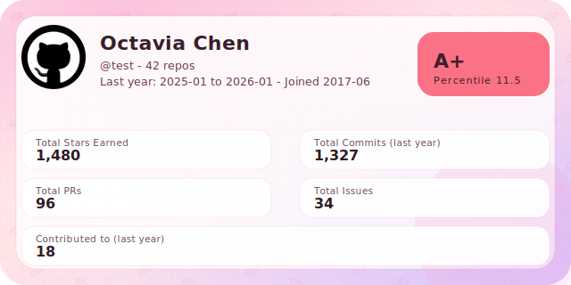

# GithubCard

[中文说明](README_CN.md)

|  |  |
| --- | --- |
| A GitHub profile card SVG generator deployed on Cloudflare Workers. |  |

## Features
- `/{username}` endpoint that returns an SVG image.
- Uses GitHub GraphQL to collect yearly contributions and totals.
- Includes a simple rating (grade + score) for quick comparison.
- Demo mode via `/{username}?demo=1` or `/test` without a token.
- Force refresh via `/{username}?refresh=1` to bypass cache once.
- Theme support via `?theme=light`, `?theme=dark` (default), `?theme=matrix`, `?theme=ayaka`, or `?theme=sakura` (snow + petals).
- Optional `LOCKED_USER` env var to restrict the worker to a single username.

## Get a GitHub Token
1. GitHub → Settings → Developer settings → Personal access tokens.
2. Create a token (Fine-grained recommended).
3. Repository access: **All public repositories** (or narrower if you prefer).
4. Permissions: `read:user` (and `repo` only if you need private data).
5. Generate and copy the token (it’s shown only once).

## Deploy
### Cloudflare Dashboard (No CLI)
1. Cloudflare Dashboard -> Workers & Pages -> Create -> Worker -> Start from scratch.
2. Open **Quick Edit / Edit code**, replace the default code with `src/index.js`.
3. **Settings -> Variables**: add `GITHUB_TOKEN` as an encrypted variable.
4. Save and Deploy.
5. Visit `https://<your-worker>.workers.dev/{github-name}` (or `/test` for demo).

### Wrangler CLI
1. Authenticate Wrangler:
   ```bash
   npx wrangler login
   ```
2. Add the GitHub token as a secret:
   ```bash
   npx wrangler secret put GITHUB_TOKEN
   ```
3. Deploy:
   ```bash
   npm run deploy
   ```
4. Access `https://your-worker-domain/{github-name}`

## Theme Preview

| Theme | Preview |
| --- | --- |
| Dark (default) |  |
| Light |  |
| Matrix |  |
| Ayaka |  |
| Sakura (snow + petals) |  |

## Local Development
1. Install dependencies
   ```bash
   npm install
   ```
2. Create a `.dev.vars` file (for `wrangler dev`):
   ```
   GITHUB_TOKEN=ghp_your_token_here
   ```
3. Start the worker
   ```bash
   npm run dev
   ```
4. Visit `http://localhost:8787/{github-name}`

## Notes
- The GitHub token only needs `read:user` + `repo` public access to query stats.
- Cached responses are stored for one hour to reduce API usage.
- Grade thresholds and scoring weights can be edited in `src/index.js`.
- Avatars are inlined in the SVG by default for GitHub README compatibility; use `?avatar=external` to keep the original URL.
- To lock the worker to a single user, set `LOCKED_USER` via Dashboard Variables or add to `wrangler.toml`:
  ```toml
  [vars]
  LOCKED_USER = "your_github_username"
  ```
